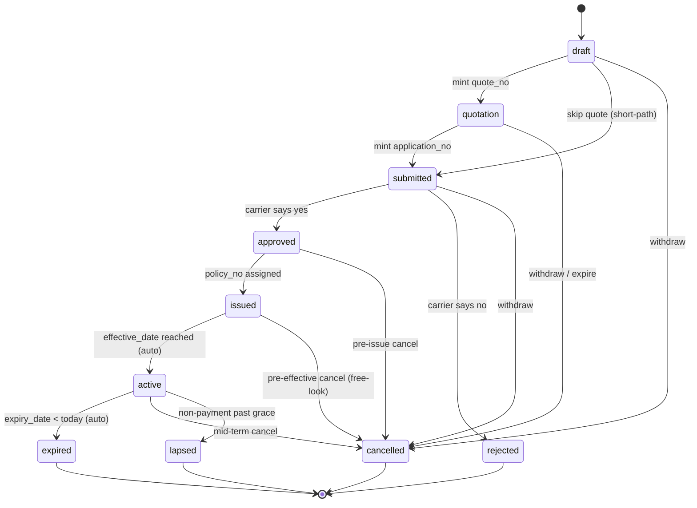

# B1 — Policy state machine spec (7-state)

Design doc. No code. Consumes audit findings from
`01-policy-state.md`, `05-live-data.md`, `00-summary.md`.



## 1. State enum

Naming rule: keep existing DB codes wherever they already carry the right
semantics (`submitted`, `active`, `cancelled`, `expired`, `lapsed`). Only
add or repurpose where the audit shows the code is unused or misused.
This keeps the migration diff small and lets legacy readers survive.

| code | name_th | name_en | group | terminal | who can enter |
|---|---|---|---|---|---|
| `draft` | ฉบับร่าง | Draft | Pre-quote | no | Agent (autosave from wizard step 1) |
| `quotation` | ใบเสนอราคา | Quotation | Pre-application | no | Agent (POST /quotes) |
| `submitted` | ส่งพิจารณา | Submitted | Pending | no | Agent (POST /quotes/{id}/convert or wizard short-path) |
| `approved` | อนุมัติ (รอเลขกรมธรรม์) | Approved | Post-underwriting | no | Agent (records carrier ack) / future carrier-webhook |
| `issued` | ออกกรมธรรม์แล้ว | Issued | Post-issue | no | Agent (Issue Policy modal — see B5) |
| `active` | คุ้มครองอยู่ | Active | In-force | no | System-scheduler (auto on effective_date) |
| `expired` | หมดอายุ | Expired | Ended | **yes** | System-scheduler (auto on expiry_date < today) |
| `cancelled` | ยกเลิก | Cancelled | Ended | **yes** | Agent / Admin (any pre-terminal state) |
| `rejected` | ถูกปฏิเสธ | Rejected | Ended | **yes** | Agent (records carrier decline post-Submitted) |
| `lapsed` | ขาดต่ออายุ | Lapsed | Ended | **yes** | System-scheduler (grace period exhausted, non-payment) |

Note on renaming: existing DB code `quote` is renamed to `quotation` at
the enum level for symmetry with the new lifecycle words. This is a
one-shot migration mapping — the row's status field is UPDATE'd during
the B1 backfill. Legacy readers that grep for `'quote'` are already dead
code (audit §6 of `01-policy-state.md`: no consumer reads
`policies.status.quote` from i18n). `/quotes` HTTP route stays (per
user's decision) — the route path is decoupled from the enum value; the
controller filters `where status = 'quotation'` after the rename.

Retired code: `reinstated`. See §8.

## 2. Transition matrix

Rows = from, cols = to. `A` = allowed (actor-triggered), `S` = auto
(scheduler), blank = blocked.

|              | draft | quotation | submitted | approved | issued | active | expired | cancelled | rejected | lapsed |
|--------------|-------|-----------|-----------|----------|--------|--------|---------|-----------|----------|--------|
| **draft**     |       | A         | A         |          |        |        |         | A         |          |        |
| **quotation** |       |           | A         |          |        |        |         | A         |          |        |
| **submitted** |       |           |           | A        |        |        |         | A         | A        |        |
| **approved**  |       |           |           |          | A      |        |         | A         |          |        |
| **issued**    |       |           |           |          |        | S      |         | A         |          |        |
| **active**    |       |           |           |          |        |        | S       | A         |          | S      |
| **expired**   |       |           |           |          |        |        |         |           |          |        |
| **cancelled** |       |           |           |          |        |        |         |           |          |        |
| **rejected**  |       |           |           |          |        |        |         |           |          |        |
| **lapsed**    |       |           |           |          |        |        |         |           |          |        |

Justifications for the non-obvious cells:

- `draft → submitted` (skip quotation): the current wizard treats short
  motor renewals as a one-shot Application. Preserving that path avoids
  forcing every renewal through a quote step.
- `submitted → cancelled`: needed for withdraw-before-carrier-response
  workflow. Distinct from `submitted → rejected` (carrier declined).
- `issued → cancelled`: covers Thai "free-look" cancellation (15-day
  window before Active). Refund fields already exist on the row.
- `active → lapsed` (scheduler): non-payment past grace. Requires the
  scheduler to know grace-period per product — punt to B5 or a later
  policy-config effort. For now, `lapsed` stays actor-triggered until
  grace is modeled; scheduler transition is planned, not implemented in
  the first rollout.
- `expired → *` blocked: renewal creates a NEW row and points its
  `ref_app_to_id` at the expired row. No in-place resurrection.
- `cancelled/rejected/lapsed → *` blocked: terminal by design. If a
  cancelled policy must be revived, agent creates a new record.

## 3. Actor / permission per transition

| Transition | Actor | Event verb | Notes |
|---|---|---|---|
| `→ draft` | Agent | `draftCreated` | Wizard step 1 autosave. No quote_no/application_no yet. |
| `draft → quotation` | Agent | `quotationMinted` | Assigns `quote_no`. Replaces current `POST /quotes` implicit behaviour with explicit event. |
| `draft → submitted` | Agent | `submittedFromDraft` | Assigns `application_no` directly. |
| `quotation → submitted` | Agent | `convertedToApplication` | **Existing verb** — assigns `application_no`. |
| `submitted → approved` | Agent (records carrier) / Carrier-webhook (future) | `underwritingApproved` | New verb. |
| `submitted → rejected` | Agent | `underwritingRejected` | New verb. Requires `status_note` (reason). |
| `submitted → cancelled` | Agent | `cancelled` | **Existing verb** — reason recorded. |
| `approved → issued` | Agent | `issued` | **Existing verb** — Issue Policy modal (B5). Requires `policy_no`, `issue_date`. |
| `approved → cancelled` | Agent | `cancelled` | |
| `issued → active` | System-scheduler | `activated` | New verb. Daily cron (§7). |
| `issued → cancelled` | Agent | `cancelled` (free-look) | |
| `active → expired` | System-scheduler | `expired` | New verb. Daily cron. |
| `active → cancelled` | Agent | `cancelled` | Mid-term. Refund workflow already exists. |
| `active → lapsed` | Agent (interim); System (later) | `lapsed` | **Existing verb** — actor-triggered until grace config modeled. |

### `LOCK_TRIGGER_STATUSES` update

Current at `Api/PolicyController.php:192`:
```
['issued','active','lapsed','cancelled','reinstated','expired']
```

Proposed:
```
['approved','issued','active','expired','cancelled','rejected','lapsed']
```

Changes:
- `approved` is added — once carrier has approved, financial fields
  freeze (§6). The current list under-locks Approved rows.
- `reinstated` is removed (retired code, §8).

The lock triggers a broader field-lock map — see §6 for per-state
detail.

## 4. Backfill rules

Source: 515 rows produced by `PolicySeeder` (§9 of `01-policy-state.md`).
`STATUS_MAP` collapses to three codes: `active` (490), `submitted` (13),
`cancelled` (12). Rename `quote → quotation` in the same migration for
consistency with the new enum (zero rows carry `quote` in seed).

### Precedence-ordered rules (first match wins)

| # | Precondition | New status |
|---|---|---|
| 1 | old = `cancelled` | **cancelled** |
| 2 | old = `submitted` AND `policy_no` IS NULL | **submitted** |
| 3 | old = `submitted` AND `policy_no` IS NOT NULL | **issued** (data quality: carrier issued but flag not flipped) |
| 4 | old = `active` AND `policy_no` IS NULL | **submitted** (data-quality downgrade — audit anomaly of 7 rows) |
| 5 | old = `active` AND `policy_no` IS NOT NULL AND `effective_date > today` | **issued** (issued but not yet in force) |
| 6 | old = `active` AND `policy_no` IS NOT NULL AND `effective_date <= today <= expiry_date` | **active** |
| 7 | old = `active` AND `policy_no` IS NOT NULL AND `expiry_date < today` | **expired** |
| 8 | `Coverage_start = 9000-01-01` placeholder (2 rows) | **draft**; null both dates; flag `import_notes` |
| 9 | old = `quote` (0 rows in seed, but for future safety) | **quotation** |
| 10 | old = `reinstated` (0 rows in seed) | **active** (see §8) |

### 11 anomalous rows (from audit §7 of `05-live-data.md`)

| Anomaly | Count | Rule | New status |
|---|---|---|---|
| `active` + no policy_no | 7 | Rule 4 | submitted |
| policy_no set + status=submitted or cancelled | 2 | Rule 1 for cancelled (keep); Rule 3 for submitted (→ issued) | mixed |
| `Coverage_End < Coverage_start` | 2 | Rule 8 (placeholder dates) | draft |
| `Coverage_start = 9000-01-01` | 1 (life sample) | Rule 8 | draft |

All 11 get an `import_notes` stamp flagging manual review. Backfill logs
every changed row to a `policy_events` entry with verb `backfillMigrated`
and an `event_note` describing which rule fired.

### Backfill guarantees

- **Idempotent**: safe to re-run. Skip if a `backfillMigrated` event
  already exists for the row.
- **Dry-run first**: `--dry-run` flag prints the (old → new) count table
  without writing.
- **Reversible**: down migration re-runs the old `STATUS_MAP` off the
  same CSV. The row's `legacy_policy_status_id` FK is preserved for
  audit trail regardless of forward/backward direction.

## 5. `PolicyEventController` diff plan

Central table at `Api/PolicyEventController.php:26-35`.

### Existing verbs — keep as-is or minor edits

| Verb | Existing target status | Action |
|---|---|---|
| `convertedToApplication` | `application` | Retarget to `submitted`. `application` is not in the new enum — the "Application" concept is now the `submitted` state carrying an `application_no`. |
| `submittedToCarrier` | `submitted` | Drop or alias to `convertedToApplication`. Under the new enum, these are the same transition. Recommend drop; keep `convertedToApplication` as canonical. |
| `issued` | `issued` | Keep. Now requires `from ∈ {approved}`. |
| `renewed` | `active` | Rename to `activated` OR keep verb name but retarget action. Recommend rename — semantics changed (activation is auto now; renewal creates a new row). Keep `renewed` as a separate verb that creates a chained row via `ref_app_to_id`. |
| `cancelled` | `cancelled` | Keep. Add guard: from ∈ {draft, quotation, submitted, approved, issued, active}. |
| `lapsed` | `lapsed` | Keep. Guard: from ∈ {active}. |
| `reinstated` | `active` | Retire (§8). |
| `detailsUpdated` | (no change) | Keep as-is. |

### New verbs

| Verb | From | To | Guard |
|---|---|---|---|
| `draftCreated` | (none) | draft | Only on create path (Policy::create). |
| `quotationMinted` | draft | quotation | Requires `quote_no` to be assignable via `nextQuoteNo()`. |
| `submittedFromDraft` | draft | submitted | Requires `application_no` via `nextApplicationNo()`. |
| `underwritingApproved` | submitted | approved | Actor: Agent or future carrier-webhook. |
| `underwritingRejected` | submitted | rejected | Requires `status_note`. |
| `activated` | issued | active | Actor: scheduler only. Guard: `effective_date <= today`. |
| `expired` | active | expired | Actor: scheduler only. Guard: `expiry_date < today`. |
| `backfillMigrated` | (any) | (any) | Actor: migration only. Never callable from HTTP. |

### Guard implementation shape

A single `assertTransitionAllowed(from, to)` method reads a static map
mirroring §2's matrix. Any HTTP-triggered event that fails the guard
returns 409 Conflict with a machine-readable body:
`{ code: 'invalid_transition', from, to, allowed_next: [...] }`.

### Files to touch (backend)

- `backend/app/Http/Controllers/Api/PolicyEventController.php` — add
  verbs, add transition map, wrap the L58 `$policy->update()` call in
  the guard.
- `backend/app/Http/Controllers/Api/QuoteController.php` — L109 (convert)
  routes through PolicyEventController's `convertedToApplication` verb
  instead of writing status directly.
- `backend/app/Http/Requests/PolicyRequest.php:72` — the `in:` list
  becomes the new enum values.
- `backend/database/migrations/…_seed_policy_status_translation.php`
  supersede: a new seeder replaces the 9 rows in `policy_statuses` with
  the 10 rows from §1 (retiring `reinstated`, adding `draft`, `approved`,
  `rejected`, renaming `quote` → `quotation`).

## 6. Locking rules — field-lock map

Rule of thumb: **once a downstream actor (carrier, customer) depends on
a field, that field locks.**

| Field group | Fields | Locks at |
|---|---|---|
| Identity | `customer_id`, `product_id`, `carrier_id`, `writing_agent_id` | **submitted** — the moment we tell the carrier "this application is for X on Y", we can't swap X or Y. |
| Coverage terms | `effective_date`, `expiry_date`, `coverage`, `policy_year`, `act_year`, `new_or_renew` | **approved** — carrier priced the risk on these terms. |
| Financial | `annual_premium`, `main_premium`, `net_premium`, `duty_stamp`, `vat`, `total_premium_paid`, `net_customer_paid`, `wht_amt`, `wht_status` | **approved** — pricing frozen. |
| Post-issue | `policy_no`, `issue_date`, `period_paid_end`, `policy_end` | **issued** — carrier-authoritative fields. |
| Mailing | `mailing_add_by_policy`, `mailing_date`, `mailing_note` | **active** — cert has been sent; changing mailing info at that point is a re-mail event, not an edit. |
| Risk data (motor/property/travel/life/health) | all `risk_data.*` keys + top-level `motor_license_no/brand/model` | **approved** — carrier underwrote on the risk. |
| Commission | rate/amount fields | **approved** — Move-not-rewrite constraint from the brief; the current recompute path stays available but locks after approval. |
| Notes | `notes`, `internal_note`, `status_note`, `import_notes` | **never** — always editable. Historical audit stays via `policy_events`. |
| Cancellation/refund | `cancel_status`, `refund_*` | **only when status = cancelled** — writeable then, locked otherwise. |
| Terminal states | ALL fields | terminal states (expired, cancelled, rejected, lapsed) lock everything except notes. |

Admin override: a role-gated `admin_override_lock` middleware lets Admin
edit locked fields with a `status_note` audit stamp. Never available to
Agent.

## 7. Auto-transitions (scheduler)

Two transitions run on a daily cron. Cron target: 00:15 Asia/Bangkok
(15-min buffer past midnight to avoid clock skew).

| Transition | Query | Verb |
|---|---|---|
| `issued → active` | `WHERE status='issued' AND effective_date <= TODAY()` | `activated` |
| `active → expired` | `WHERE status='active' AND expiry_date < TODAY()` | `expired` |

Not automatic:
- `approved → issued`: requires human input (policy_no from carrier).
- `active → lapsed`: requires grace-period model per product. Deferred —
  actor-triggered until grace config lands.
- `submitted → approved/rejected`: requires human input (carrier decision).

Implementation location: a new `TransitionPoliciesDaily` command under
`backend/app/Console/Commands/`, wired into `backend/routes/console.php`
via `Schedule::command('policies:transition-daily')->dailyAt('00:15')`.
The command routes through `PolicyEventController` (or a service the
controller shares) so the guard and event-log stay the sole write path.

Failure handling: per-row transaction; failures logged with the row id
and skipped. Job emits a summary line to `storage/logs/laravel.log` and
optionally a Slack/webhook alert if any row fails (defer webhook wiring
to a follow-up).

## 8. Rejected / Cancelled / Reinstated distinction

**Rejected**: carrier declined the application. Only reachable from
`submitted`. Requires `status_note` (the reason from the carrier).
Terminal.

**Cancelled**: withdrawn by customer or agent. Reachable from any
pre-terminal state. Different sub-reasons live in `status_note` /
`cancel_status`:
- pre-Approved: no-cost withdraw.
- Approved/Issued (free-look): triggers refund workflow (refund_* columns).
- Active mid-term: pro-rata refund workflow.
Terminal.

**Reinstated** → **retired**. Rationale:
- Zero rows in seed (§9 `01-policy-state.md`).
- Semantically muddled — reinstating from `lapsed` is really "revive
  policy to Active" which the state machine doesn't allow (§2 blocks
  terminal → non-terminal). The lapsed policy stays lapsed; a new row
  chained via `ref_app_to_id` handles the revive.
- The backfill maps any surprise `reinstated` legacy row → `active` (in
  practice this never fires).

If a "revive" workflow is needed later, add a new terminal-out
transition `lapsed → reinstated` with explicit product-side pricing
recomputation. Not in scope for the first rollout.

## 9. Rollout plan

Five PRs, each independently deployable and reversible.

### PR-1: schema + seeder (no reader/writer changes)

- Migration `2027_02_15_000100_add_new_policy_statuses.php` inserts the
  10 rows from §1 into `policy_statuses` alongside the existing 9. Both
  sets coexist; nothing reads the new rows yet.
- No `policies.status` column change (already `string(32)`).
- Ship + verify.

### PR-2: backfill script (idempotent, dry-run first)

- Command `policies:backfill-statuses --dry-run` prints (old → new)
  histogram against production data.
- Command without flag runs the migration inside a transaction per
  batch, writing `policy_events` verb `backfillMigrated` per row.
- Ship, run `--dry-run` in staging, verify counts match §4 expectations,
  run for real.

### PR-3: backend enum + guards

- Update `PolicyRequest.php:72` `in:` list.
- Add transition matrix + `assertTransitionAllowed()` to
  `PolicyEventController`.
- Add new verbs (§5). Retarget `convertedToApplication` to `submitted`.
- Retire `reinstated` verb (return 410 Gone).
- Route `QuoteController::convert()` through `PolicyEventController`.
- Old enum values (`application`, `quote`) still accepted on READ paths
  via a legacy alias in the resource; POST/PATCH rejects them.

### PR-4: frontend badges + filters + store guards

- Consolidate status label rendering into a single helper
  (`utils/policyStatus.ts`) that reads from the i18n block. Kill the
  hardcoded strings in `PolicyListV2.vue:361-366`,
  `PolicyDetailDrawer.vue:15-19`, `PolicyEdit.vue:445-448`,
  `PolicyCreateWizard.vue:1553-1558`.
- Rewrite `stores/policies.ts:485-622` transition guards against the new
  matrix.
- Update `PolicyListV2` filter dropdown to the 10 new codes.
- Repurpose the dead `i18n/th.ts` `policies.status.*` block (audit §7)
  and add English mirror.

### PR-5: scheduler command + retire legacy paths

- Add `TransitionPoliciesDaily` command + schedule.
- Remove `application`/`quote` legacy-alias code from PR-3 once one
  release cycle has passed and no client sends the old values.
- Drop `policy_status_translations` rows for retired codes.

### Verification per PR

- PR-1: `SELECT code, COUNT(*) FROM policy_statuses GROUP BY code` shows
  both sets.
- PR-2: `SELECT status, COUNT(*) FROM policies GROUP BY status` matches
  the histogram §4 produces.
- PR-3: PHPUnit test per transition (allowed + blocked matrix).
- PR-4: Playwright/smoke run of wizard → detail drawer round-trip on a
  sample of each new status.
- PR-5: cron dry-run in staging with a seed row set to
  `expiry_date = yesterday` — confirm it flips to `expired`.

## 10. Open questions

1. **Approved → Issued gap in Thai carrier reality**: the audit brief
   confirms 7-state, but is there a real workflow where an underwriter
   verbally approves ("bind"), and the operator records that BEFORE the
   carrier back-office sends the policy_no? If not, `approved` is
   effectively vestigial and the wizard would jump straight
   `submitted → issued`. Confirm.

2. **Free-look cancellation window**: 15 days is Thai default for life
   products; motor is typically no free-look. Is the free-look
   `issued → cancelled` transition permitted for all product kinds, or
   life/health only? If gated by kind, add a kind check in the guard.

3. **Lapse scheduler**: `active → lapsed` is left actor-triggered in the
   first rollout because grace period per product isn't modeled. Should
   PR-6 add a `grace_days` column to `products` (or `product_types`) and
   automate lapse? Or does lapse stay agent-triggered indefinitely?

4. **Carrier-webhook actor**: `underwritingApproved` lists it as future.
   Do we scaffold the endpoint now (accept a webhook token, no-op if not
   configured), or defer until a specific carrier integration is
   scheduled?

5. **`policy_no` uniqueness after backfill**: the audit notes the unique
   index was relaxed (`2027_01_01_000700_relax_policy_no_unique.php`).
   With state now enforcing that Issued rows have a `policy_no`, should
   the unique constraint be re-tightened to `(tenant_id, policy_no)
   WHERE status IN ('issued','active','expired','cancelled','lapsed')`?
   Partial index — MySQL 8 supports functional; needs verification.
